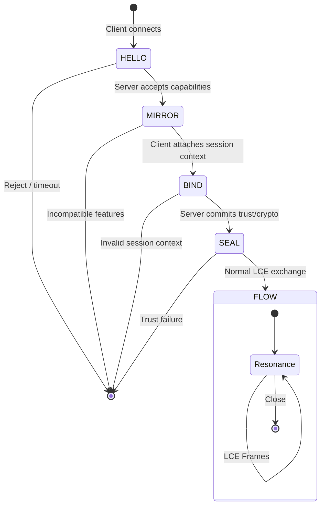

# Liminal Handshake Sequence (LHS)

The Liminal Handshake Sequence establishes mutual awareness between an LRI-aware
client and server before any Liminal Communication Envelope (LCE) payloads are
exchanged. It harmonises connection setup across HTTP upgrade and native
WebSocket transports by enforcing a canonical five-step progression:

1. **Hello** – the client proposes protocol capabilities.
2. **Mirror** – the server reflects compatibility and resolves the channel
   contract.
3. **Bind** – the client anchors intent to a session/thread context.
4. **Seal** – the server commits cryptographic trust guarantees for the flow.
5. **Flow** – both parties exchange LCE frames under the negotiated contract.

The sequence is intentionally symmetrical with the Layer-8 ethos: each stage
captures a distinct human/agent need (intention, acknowledgement, attachment,
trust and resonance) while remaining machine-verifiable.

---

## 1. Transport Overview

LHS can ride on any duplex transport that supports message framing. The default
profile targets WebSocket, but the same semantics can be expressed via HTTP
Upgrade headers. Implementations MUST treat the negotiated result as binding for
the duration of the session.

Key transport properties:

- **Deterministic ordering.** Steps must arrive in the precise order
  `hello → mirror → bind → seal`. Any deviation is a protocol error.
- **Idempotent retries.** `hello` MAY be retried after connection loss; all
  subsequent steps are single-shot per connection.
- **Capability envelopes.** Both `hello` and `mirror` contain capability maps so
  the client and server can converge on supported encodings, features and
  maximum payload sizes.

---

## 2. State Machine



---

## 3. Message Definitions

All LHS control frames are JSON objects with the following canonical structure:

### 3.1 Hello (client → server)

```json
{
  "step": "hello",
  "lri_version": "0.1",
  "encodings": ["json", "cbor"],
  "features": ["ltp", "lss"],
  "max_frame_bytes": 65536,
  "session": {
    "kind": "ephemeral",
    "locale": "en-US"
  }
}
```

Required fields:

- `lri_version` – LRI semantic version string. The server MUST compare against
  supported versions and reject unknown majors.
- `encodings` – ordered preference list for LCE framing (e.g. `json`, `cbor`).
- `features` – requested optional capabilities (`ltp`, `lss`, `telemetry`).
- `max_frame_bytes` – soft limit for downstream frames.

Optional `session` metadata allows the client to communicate user agent hints
without committing to a thread yet.

### 3.2 Mirror (server → client)

```json
{
  "step": "mirror",
  "lri_version": "0.1",
  "encoding": "json",
  "features": ["ltp"],
  "max_frame_bytes": 32768,
  "nonce": "srvr-47f89a"
}
```

The server MUST echo a compatible version and choose a single encoding. Features
reported here are authoritative: any capability absent from the array is
considered disabled. The `nonce` MUST be a unique token bound into the Seal
signature to prevent replay.

### 3.3 Bind (client → server)

```json
{
  "step": "bind",
  "thread": "9b1deb4d-3b7d-4bad-9bdd-2b0d7b3dcb6d",
  "auth": {
    "scheme": "Bearer",
    "token": "eyJhbGciOiJIUzI1NiIsInR5cCI6IkpXVCJ9..."
  },
  "context": {
    "intent": {
      "type": "teach"
    },
    "affect": {
      "pad": [0.2, 0.1, 0.3]
    }
  }
}
```

Bind ties the connection to an LRI session. `thread` MUST be a stable identifier
(UUID or ULID). Authentication material MAY be embedded or referenced out-of-
band. Optional `context` seeds LSS metrics before the first flow frame.

### 3.4 Seal (server → client)

```json
{
  "step": "seal",
  "session_id": "flow-13d8a2",
  "expires_at": "2024-05-18T12:05:11Z",
  "signature": "ltp:jws:eyJhbGciOiJFZERTQSIsInR5cCI6IkxURUwi...",
  "features": {
    "ltp": {
      "jws": {
        "alg": "EdDSA",
        "nonce": "srvr-47f89a"
      }
    }
  }
}
```

Seal finalises the contract. The `signature` MUST be produced via LTP over the
canonical concatenation of the `hello`, `mirror` and `bind` payloads plus the
server nonce. If verification fails, the client MUST abort the connection.

---

## 4. Error Handling

If any step fails validation, the rejecting party SHOULD send a terminal error
frame:

```json
{
  "step": "error",
  "code": "lhs.invalid_bind",
  "detail": "thread missing or malformed"
}
```

After emitting an error the connection MUST close without entering `flow`.

Common error codes:

| Code | Description |
| --- | --- |
| `lhs.version_mismatch` | `hello` references an unsupported version |
| `lhs.encoding_negotiation_failed` | no shared encoding between hello/mirror |
| `lhs.invalid_bind` | session thread/auth data missing or invalid |
| `lhs.trust_failed` | seal signature verification failed |

---

## 5. HTTP Upgrade Profile

When LHS is negotiated via HTTP Upgrade, the handshake maps to headers detailed
in [`examples/lhs/http.json`](../../examples/lhs/http.json). Servers SHOULD
respond with `101 Switching Protocols` only after validating the proposed
capabilities and generating the Seal commitment.

Key headers:

- `LHS-Hello` – base64url encoded JSON hello payload.
- `LHS-Mirror` – server reflection header with chosen encoding/features.
- `LHS-Seal` – final commitment header containing `session_id` and `signature`.

---

## 6. WebSocket Profile

Native WebSocket implementations transmit each control frame before switching to
LCE flow frames. See [`examples/lhs/ws.json`](../../examples/lhs/ws.json) for a
line-by-line trace. After the Seal acknowledgment, endpoints MUST prefix all
subsequent messages with LCE payloads encoded according to the negotiated
`encoding`.

---

## 7. Compliance Checklist

An implementation is LHS compliant when it:

1. Validates step ordering and required fields.
2. Enforces negotiated encoding/features during flow.
3. Produces a Seal signature that covers Hello, Mirror, Bind and the server
   nonce.
4. Surfaces structured error frames and terminates on trust failures.
5. Emits telemetry hooks so LSS can initialise coherence metrics from Bind.

When these criteria are satisfied the handshake is considered **Ratified** and
ready for integration across SDKs and services.
